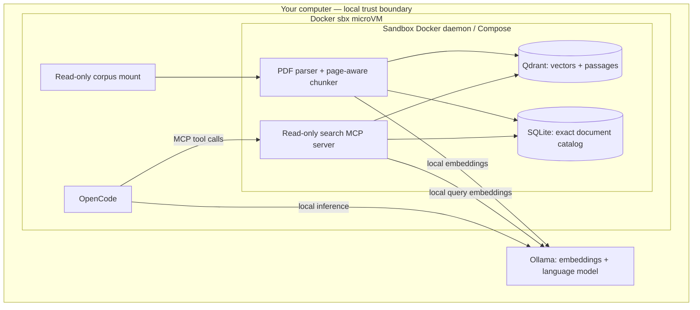

# Privacy First Search Lab

**From local loan agreements to cited answers through MCP, inside a Docker Sandbox.**

A hands-on workshop for **Nerdearla Argentina 2026**, accompanying *Building
Privacy-First Vector Search Pipelines With Local LLMs* by Rudraksh Karpe.

Learn where documents, embeddings, retrieved passages, model requests, and agent
tools actually run. Build a searchable local corpus, inspect the evidence, and
watch OpenCode call your own MCP server using a local Ollama model.

[](https://github.com/rudrakshkarpe/privacy-first-search-lab/actions/workflows/checks.yml)

**Current scope:** the full local corpus/retrieval/MCP path and small-model harness
rehearsal are implemented. The sbx kit validates; actual sandbox creation and
network-isolation rehearsal require Docker sign-in. See the explicit
[verification record](docs/verification.md) before treating this as stage-ready.

## Run the workshop

```bash
# Main path: authenticate Docker sbx first
sbx login
./workshop prepare
./workshop doctor
./workshop privacy-check
./workshop demo
```

For a fast functional dry run without sbx authentication:

```bash
./workshop prepare --local
./workshop demo --local
```

The default language model is **Llama 3.2 3B with a 16K demo context**. Embeddings
use **nomic-embed-text:v1.5**. A dedicated Ollama process on port **11435** disables
cloud support. No large-model or hosted-provider fallback is configured. Local
mode is explicitly not a sandbox-isolation demonstration.

The presenter advances with **Enter**, skips with `s`, and exits with `q`.
Resume at a chosen step with `./workshop demo --from-step 4`.

## The system



The **sandbox is the isolation boundary**. Compose manages services inside it.
Ollama stays on the host for Apple Silicon acceleration. The host endpoint is
an intentional exception to sandbox isolation, not an external model provider.

## Learning outcomes

1. Parse PDFs locally and preserve file, page, and chunk provenance.
2. Understand embeddings, similarity ranking, and exact metadata filters.
3. Keep the search interface independent of the vector database implementation.
4. Expose small, bounded, read-only retrieval tools over MCP.
5. Observe a coding harness select tools and produce evidence-backed answers.
6. Distinguish application settings from enforced network restrictions.
7. Rehearse and diagnose a live demo without relying on venue downloads.

## Corpus

The workshop corpus is 40 fictional loan agreements across five illustrative
borrower groups. Its index states that identities, financial figures, addresses,
and agreements are synthetic. These are specimen contracts, not regulatory
authorities or a basis for legal compliance determinations.

Source PDFs, derived indexes, model conversations, and reports are ignored by
Git. Public access to a Drive folder is not itself a redistribution license.
The repository provides a local import workflow and separately authored test
fixtures rather than publishing the supplied PDFs.

## Start here

- [Quickstart and prerequisites](docs/quickstart.md)
- [Architecture and trust boundaries](docs/architecture.md)
- [How Docker sbx fits and how to inspect its policy](docs/sandbox.md)
- [PDF ingestion, chunking, embeddings, and source identity](docs/ingestion.md)
- [MCP tools and example requests](docs/mcp-tools.md)
- [Audience exercises with expected observations](docs/exercises.md)
- [60-minute presenter runbook](docs/presenter.md)
- [Operations, troubleshooting, and retention](docs/operations.md)
- [Verification record and remaining release gates](docs/verification.md)
- [Design decisions](docs/decisions/001-local-first.md)

## What makes this more than a chat-over-PDF example?

| Concern | Concrete implementation |
|---|---|
| Traceable evidence | Stable chunk IDs, source SHA-256, document ID, page and ordinal |
| Exact questions | Catalog filters and validated repayment rows alongside vector search |
| Database portability | Qdrant and an educational SQLite cosine scan share contract tests |
| Safe tool surface | Five bounded read-only MCP tools; no shell/upload/arbitrary-path tool |
| Index lifecycle | Idempotence, embedding digest checks, stale/partial-data rejection, explicit removal |
| Visible isolation | Credential-free sbx kit, private DB network, allowlist audit and egress probes |
| Honest model quality | Actual tool-call trace and a source-checked quotation rehearsal |
| Reproducible teaching | Pinned dependencies, image digests, CI, exercises, and resumable script |

The supplied corpus yields **40 documents → 178 pages → 481 chunks**, plus **1,744
validated repayment rows**. Source PDFs, vector payloads, session traces, and reports
stay local and outside version control.

Read the [commit history](https://github.com/rudrakshkarpe/privacy-first-search-lab/commits/main/)
to follow architecture, parsing, retrieval, MCP, containers, sandbox policy,
small-model tuning, regression fixes, and rehearsal as separate changes.

## License

Repository code and documentation: [MIT](LICENSE). Third-party documents, models,
and dependencies retain their own terms. No rights to the source PDFs are granted
by this repository's license.
