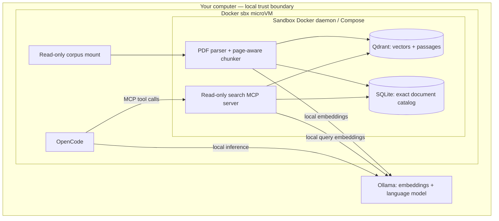

# Privacy First Search Lab

**From local loan agreements to cited answers through MCP, inside a Docker Sandbox.**

A hands-on workshop for **Nerdearla Argentina 2026**, accompanying *Building
Privacy-First Vector Search Pipelines With Local LLMs* by Rudraksh Karpe.

Learn where documents, embeddings, retrieved passages, model requests, and agent
tools actually run. Build a searchable local corpus, inspect the evidence, and
watch OpenCode call your own MCP server using a local Ollama model.

## The system

The **sandbox is the isolation boundary**. Compose manages services inside it.
Ollama stays on the host for Apple Silicon acceleration. The host endpoint is
an intentional exception to sandbox isolation, not an external model provider.

## Learning outcomes

1. Parse PDFs locally and preserve file, page, and chunk provenance.
2. Understand embeddings, similarity ranking, and exact metadata filters.
3. Keep the search interface independent of the vector database implementation.
4. Expose small, bounded, read-only retrieval tools over MCP.
5. Observe a coding harness select tools and produce evidence-backed answers.
6. Distinguish application settings from enforced network restrictions.
7. Rehearse and diagnose a live demo without relying on venue downloads.

## Corpus

The workshop corpus is 40 fictional loan agreements across five illustrative
borrower groups. Its index states that identities, financial figures, addresses,
and agreements are synthetic. These are specimen contracts, not regulatory
authorities or a basis for legal compliance determinations.

Source PDFs, derived indexes, model conversations, and reports are ignored by
Git. Public access to a Drive folder is not itself a redistribution license.
The repository provides a local import workflow and separately authored test
fixtures rather than publishing the supplied PDFs.

## Start here

- [Architecture and trust boundaries](docs/architecture.md)
- [Design decisions](docs/decisions/001-local-first.md)

The implementation and workshop commands are added in focused commits. Read the
history to follow the build from architecture through ingestion, tools, isolation,
and rehearsal.

## License

Repository code and documentation: [MIT](LICENSE). Third-party documents, models,
and dependencies retain their own terms. No rights to the source PDFs are granted
by this repository's license.
