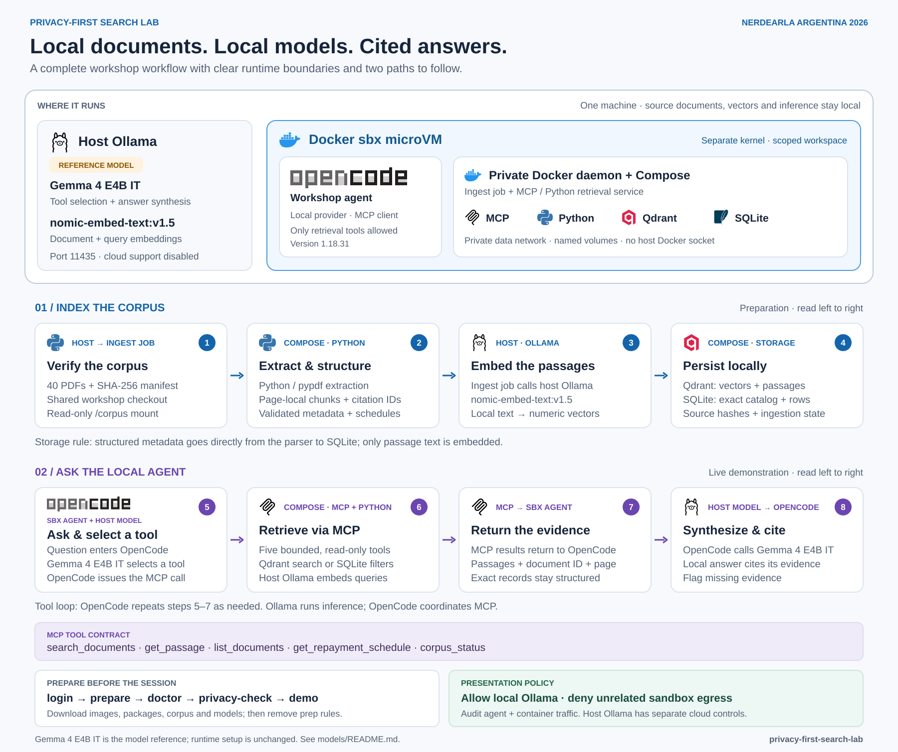

# Privacy First Search Lab

[](https://github.com/hrittikhere/Nerdearla-BA-privacy-first-search-lab/actions/workflows/checks.yml)

**Build a local document-search pipeline, expose it through MCP, and watch a small local model use it from OpenCode.**

A hands-on workshop for **[Nerdearla Argentina 2026](https://nerdearla.com/en/argentina/2026/)**,
accompanying *Building Privacy-First Vector Search Pipelines With Local LLMs*.

Lab by [Rudraksh Karpe](https://github.com/rudrakshkarpe),
[Hrittik Roy](https://github.com/hrittikhere), and
[Shivay Lamba](https://github.com/shivaylamba).

Follow a document from PDF extraction to embeddings, vector search, cited evidence,
and an agent's answer. The main architecture runs OpenCode and the search services
inside Docker sbx, with a dedicated local Ollama process providing inference on the
host. A lighter local mode lets you rehearse the same retrieval and MCP workflow
without creating a sandbox.

## Contents

- [What you will learn](#what-you-will-learn)
- [Architecture and the role of Docker sbx](#architecture-and-the-role-of-docker-sbx)
- [Choose a run mode](#choose-a-run-mode)
- [Prerequisites and model choices](#prerequisites-and-model-choices)
- [Setup from a fresh clone](#setup-from-a-fresh-clone)
- [Corpus and ingestion](#corpus-and-ingestion)
- [Try the retrieval pipeline](#try-the-retrieval-pipeline)
- [MCP and the OpenCode tool loop](#mcp-and-the-opencode-tool-loop)
- [The Enter-to-advance demo](#the-enter-to-advance-demo)
- [Privacy boundaries and limitations](#privacy-boundaries-and-limitations)
- [Verification and development](#verification-and-development)
- [Troubleshooting and cleanup](#troubleshooting-and-cleanup)
- [Repository map and further reading](#repository-map-and-further-reading)
- [Contributing and license](#contributing-and-license)

## What you will learn

This workshop is for developers, platform engineers, and practitioners exploring
local retrieval-augmented generation (RAG). Basic command-line, Python, and Docker
familiarity helps; you do not need to have built an MCP server before.

By the end, you should be able to:

1. Parse documents locally and preserve file, page, and chunk provenance.
2. Explain how chunking and embeddings affect semantic retrieval.
3. Choose semantic search, exact metadata filters, or structured table access for a question.
4. Swap vector implementations behind a shared interface.
5. Expose bounded, read-only retrieval tools through Model Context Protocol (MCP).
6. Trace how OpenCode asks a local model to select tools and use their results.
7. Separate local processing, application permissions, and enforced network isolation.
8. Rehearse a demo with cached dependencies and inspect failures when they happen.

The implementation is deliberately inspectable: a Python parser and service,
two vector adapters, five MCP tools, and a presentation script. It is a workshop
reference with a single-user trust boundary, not a multi-tenant compliance platform.

## Architecture and the role of Docker sbx

[](docs/assets/workshop-workflow-gemma4.svg)

The diagram separates the **runtime map** from two **left-to-right workflows**.
[Open the full-size diagram](docs/assets/workshop-workflow-gemma4.svg) for presentation.

The blue indexing lane prepares the corpus:

1. Verify the PDF corpus and mount it read-only into the ingestion container.
2. Extract pages, create chunks with stable citation IDs, and validate metadata
   and repayment schedules.
3. Call host Ollama to embed passage text with `nomic-embed-text:v1.5`.
4. Persist vectors and passages in Qdrant; store exact fields, schedules, source
   hashes, and ingestion state in SQLite. Structured fields bypass embedding.

The purple answering lane follows a live audience question:

5. Send the question to OpenCode; the small local model selects a tool and
   OpenCode issues the MCP call.
6. Validate the request and retrieve evidence through the five read-only MCP
   tools. Semantic search uses local query embeddings and Qdrant; exact filters
   and repayment schedules use SQLite.
7. Return passages with document IDs and page numbers, or structured records,
   through MCP to OpenCode. Repeat the tool loop as needed.
8. OpenCode sends the evidence to the local model and displays its cited answer.

The runtime map above the lanes shows the sbx microVM boundary. Its private Docker
daemon owns the Compose containers, networks, images, and volumes. Host Ollama
remains outside that border for local hardware acceleration. Location labels on
the workflow cards identify where each step executes; repeated tool names refer
to the same running services. The bottom panels show preparation and presentation
policy separately from the data flow.

### Two data flows

**Ingestion:** PDF → page text → validated metadata and repayment rows → page-local
chunks → local embeddings → vector store. The SQLite catalog stores exact fields,
source hashes, schedules, and ingestion state alongside the vector index.

**Answering:** question → OpenCode → local model → MCP tool request → retrieval
service → evidence with citations → local model → answer. Ollama runs the model;
OpenCode coordinates the tool calls. Ollama does not connect to MCP itself.

### What sbx adds

Docker sbx is the intended **microVM isolation boundary** for the agent and search
stack. Docker Compose runs Qdrant, the MCP service, and the ingestion job using the
sandbox's Docker daemon. The kit adds a scoped local inference destination and
contains no cloud-provider credentials. Preparation temporarily permits package
and image downloads; the script then attempts to remove those preparation rules.
The effective policy must pass the audit before presentation.

Ollama stays on the host to use Apple Silicon acceleration. Its local endpoint is
an explicit boundary crossing. The sandbox does not control the host Ollama
process's own outbound traffic, so that process separately disables cloud support.
Only the workshop checkout is shared with sbx; the ingestion container receives
the corpus through a read-only mount. The shared checkout itself is not immutable.

### Why keep an exact catalog beside vectors?

“Where does this agreement discuss early repayment?” is a semantic retrieval task.
“Which quarterly loans exceed $10 million?” requires exact filtering over the
catalog. A few similar passages cannot establish an exhaustive portfolio count.
Repayment schedules also need validated columns and arithmetic, rather than an
LLM guessing relationships from flattened PDF text.

Read the [architecture](docs/architecture.md), [sbx guide](docs/sandbox.md), and
[design decision](docs/decisions/001-local-first.md) for the full rationale.

## Choose a run mode

| Mode | Search storage | What it exercises | Current evidence |
|---|---|---|---|
| `./workshop prepare --local` | SQLite catalog and SQLite cosine scan | Fast ingestion, retrieval, MCP, and OpenCode rehearsal on the host | Verified with the full corpus and Gemma 4 E2B IT on 22 September 2026 |
| Standalone Docker Compose | Qdrant plus SQLite catalog in service volumes | Container packaging, Qdrant, and HTTP MCP on Docker Desktop | Verified; see [commands](docs/operations.md#standalone-container-validation) |
| `./workshop prepare` | Qdrant plus SQLite catalog inside sbx | Intended workshop architecture with microVM and egress policy | Verified with sbx 0.43.0, the full corpus, and MCP; last generation-model rehearsal there used Llama 3.2 3B |

All modes share the same parser, retrieval service, and MCP tool contract. Local
mode has no sandbox containment. Running Compose on Docker Desktop also does not
establish that the sbx network policy works.

## Prerequisites and model choices

| Requirement | Details |
|---|---|
| Host | Initial validation used an Apple Silicon Mac with 24 GiB unified memory; this is an observed environment, not a tested minimum |
| Common tools | Git, Python 3.11–3.13, `uv`, and Ollama |
| Local mode | Node/npm; preparation installs OpenCode 1.18.31 under `.local/` |
| Sandbox mode | Docker Sandboxes CLI and Docker account sign-in; verified with sbx 0.43.0 |
| Standalone containers | Docker Desktop with Compose |
| Preparation | Internet access and disk space for PDFs, packages, images, and model files |

Linux and Windows/WSL have not been rehearsed here. Prepare downloads before the
session; first-run setup time depends on your connection and cache state.

| Model role | Model / setting | Reason |
|---|---|---|
| Generation and tool selection | **[Gemma 4 E2B IT](https://huggingface.co/google/gemma-4-E2B-it)** (`gemma4:e2b`) | Local generation and tool selection |
| Demo context | **16,384 tokens**, up to 2,048 output tokens | A runtime setting, not the model's maximum context |
| Embeddings | **nomic-embed-text:v1.5** | Same local model for document and query vectors |

Documentation, diagram, and runtime all use Gemma 4 E2B IT. `./workshop prepare`
pulls `gemma4:e2b` (about 7.2 GB) and builds the `privacy-lab-local` alias from
it. See [model references](models/README.md) for the download and memory budget.

[The Modelfile](models/Modelfile) sets the generation context and temperature zero.
[OpenCode configuration](opencode.json) selects the local provider and workshop
agent. There is no large-model or hosted-provider fallback. The model can still
omit citations or invent prose; the two prepared answer steps include narrow
quotation checks. Temperature zero is not a guarantee of factuality or identical output.

Packages are locked in `uv.lock`, and service/template images are pinned by digest.
Model tags can change: the index records the embedding model identity and digest
and rejects an incompatible query model. Changing the embedding model or parser
requires a fresh index.

## Setup from a fresh clone

Run the commands below from the repository root after installing the prerequisites.

```bash
git clone https://github.com/hrittikhere/Nerdearla-BA-privacy-first-search-lab.git
cd Nerdearla-BA-privacy-first-search-lab
```

### Fast local dry run

```bash
./workshop prepare --local
./workshop doctor --local
./workshop demo --local
```

Preparation starts the dedicated Ollama endpoint, downloads missing model files,
reuses the corpus shipped in the repository, installs the locked Python dependencies, ingests the PDFs, installs
the pinned local OpenCode harness, and starts the MCP server. The preflight checks
cloud-disabled inference, corpus readiness, source hashes, and the MCP protocol.

### Main Docker sbx path

On macOS, install sbx if needed and complete its browser sign-in:

```bash
brew tap docker/tap
brew install docker/tap/sbx
./workshop login
```

Then prepare and verify the sandbox:

```bash
./workshop prepare
./workshop doctor
./workshop privacy-check
./workshop demo
```

`./workshop login` starts Docker's browser device flow when needed, verifies the
result with `sbx ls`, and runs `sbx diagnose`. `prepare` performs the same login
check and reuses an existing named sandbox when present. It creates
`privacy-search-lab` with 3 GiB memory and four CPUs, pins OpenCode 1.18.31 inside
the sandbox, builds the service image, starts Compose, and ingests the corpus.
It does not reset an existing global sandbox policy. `privacy-check` verifies the
effective rules, local inference access, blocked external requests from both the
agent and service container, retrieval after the denial, and the policy log.

`doctor` is the demo's first step, and it now runs `prepare` itself when the named
sandbox does not exist, so `./workshop demo` no longer fails at step 1 on a fresh
machine. That path needs the network and several minutes, so run it before the
session rather than on stage.

`privacy-check` only passes when the global sbx policy is `deny-all`. A machine whose
policy was initialized as `balanced` keeps roughly 180 external allowances, and the
audit correctly refuses to certify it. Preparation never resets that global policy for
you; changing it affects every sandbox on the host.

### Endpoints and local state

| Endpoint or location | Purpose |
|---|---|
| Host `127.0.0.1:11435` | Dedicated workshop Ollama with `OLLAMA_NO_CLOUD=1` |
| `127.0.0.1:8765/mcp` | MCP endpoint on the host in local mode, or inside the microVM in sbx mode |
| `127.0.0.1:8765/health` | MCP service health in the same environment |
| `qdrant:6333` | Compose-internal database; no database port published to the host |
| `data/source/` | Corpus PDFs; `data/source/dummy_loan_agreements_40/` is committed, everything else is ignored by Git; all of it is excluded from Docker build contexts |
| `data/index/` | Local-mode catalog and vector index |
| `.local/` | Process IDs, logs, harness installation, conversations, and rehearsal reports |
| Compose volumes | Container-mode catalog and Qdrant storage |

The dedicated Ollama process shares already downloaded model files but does not
change the regular Ollama service at port 11434. If port 11435 is occupied by an
Ollama process with cloud support enabled, preparation refuses to use it.

## Corpus and ingestion

The repository ships the corpus in [`data/source/dummy_loan_agreements_40/`](data/source/dummy_loan_agreements_40/). It
contains **40 fictional loan agreements** spanning five illustrative borrower
groups: household, microbusiness, small business, midsize, and corporation.
The corpus index declares the identities and agreements synthetic. These specimens
support document-review exercises; they are not regulatory authorities or a basis
for legal compliance determinations.

| Extracted material | Verified count |
|---|---:|
| Agreements | 40 |
| PDF pages | 178 |
| Page-local chunks | 481 |
| Validated repayment rows | 1,744 |

The parser extracts text locally, checks the specimen layout, and validates
repayment arithmetic using integer cents. It creates chunks of up to **180 words
with 30-word overlap**, keeping each chunk within one page. Every chunk carries a
stable UUID, document ID, filename, source SHA-256, page, and ordinal.

Unchanged ready documents are skipped on re-ingestion. Partial or failed
replacements are excluded from retrieval, and source hashes prevent old vector
payloads from being returned as the current document. Deleting a source file does
not silently delete its indexed copy; use explicit removal or rebuild the index.

The importer is tailored to these specimens. Unsupported layouts, encrypted PDFs,
scanned/empty pages, oversized files, and invalid schedules fail visibly. OCR and
arbitrary-contract extraction are extensions, not shipped features.

The 40 PDFs and their customer index are committed under `data/source/dummy_loan_agreements_40/`, so a fresh
clone has the complete corpus and preparation skips the network download. The
[provenance manifest](data/manifest.json) records each file's SHA-256, page count,
and chunk count, and `verify-sources` checks the files against it. The original
[Drive folder](https://drive.google.com/drive/folders/1hSegm8i5YgFJfEuHNIDEigXVIDf_5kjv)
remains a fallback: `./workshop fetch` downloads it only when `data/source/` has no PDFs.
Any other documents you place under `data/source/` stay ignored by Git. See [data handling](data/README.md) and
[ingestion internals](docs/ingestion.md).

## Try the retrieval pipeline

After `./workshop prepare --local`, these commands exercise each retrieval path
without asking the language model to produce an answer. They use the default
local SQLite index and dedicated Ollama endpoint.

```bash
# Inspect extraction and index state
PYTHONPATH=src uv run privacy-lab inspect data/source
PYTHONPATH=src uv run privacy-lab status

# Semantic clause retrieval within one agreement
PYTHONPATH=src uv run privacy-lab search \
  "fees and voluntary prepayment" --document-id DEMO-LA-2026-001 --limit 3

# Exact portfolio filter: quarterly loans strictly above $10 million
PYTHONPATH=src uv run privacy-lab list \
  --frequency quarterly --min-principal-cents 1000000001

# Validated repayment rows, with source provenance
PYTHONPATH=src uv run privacy-lab schedule DEMO-LA-2026-001

# Check source files against the index
PYTHONPATH=src uv run privacy-lab verify-sources data/source
```

Expected observations for the supplied corpus:

- The prepayment search retrieves relevant page-2 evidence.
- The exact filter returns a total of **10 matching loans**.
- Agreement 001 has **12 repayment rows**, ending at a zero closing balance.

The minimum-principal filter is inclusive and takes **integer USD cents**.
`1000000001` means strictly above $10 million; `1000000000` includes exactly
$10 million. Follow `next_offset` before making exhaustive claims about larger
result sets. Semantic scores measure similarity, not confidence or legal certainty.

For the sandbox, execute the same CLI inside its MCP container, for example:

```bash
sbx exec -w "$PWD" privacy-search-lab \
  docker compose exec -T mcp privacy-lab status
```

## MCP and the OpenCode tool loop

The application exposes retrieval through **five read-only MCP tools**. This is a
bounded service in front of the vector database and catalog, rather than direct
agent access to database administration.

| Tool | Use it for | Bound |
|---|---|---|
| `search_documents` | Similar clauses, optionally restricted by document ID | Query up to 2,000 characters; 1–10 hits |
| `get_passage` | Re-open a chunk returned by search | One chunk UUID; no arbitrary file path |
| `list_documents` | Exact category, frequency, and principal filters | 1–50 documents per page |
| `get_repayment_schedule` | Validated structured table rows | 1–24 rows per page |
| `corpus_status` | Counts and embedding identity | No document bodies |

For example, a search tool request carries these arguments:

```json
{
  "query": "fees and voluntary prepayment",
  "document_id": "DEMO-LA-2026-001",
  "limit": 3
}
```

The result includes passage text and provenance. OpenCode exposes the tool with
its MCP server prefix, such as `loans_search_documents`, sends the result back to
the local model, and displays the answer. The workshop agent's permissions allow
only the `loans_*` tools. Ingestion, deletion, shell execution, arbitrary file
access, and web access are not available to it.

```bash
# Discover tools and exercise validation over the real HTTP MCP connection
PYTHONPATH=src uv run privacy-lab mcp-smoke

# Open the interactive harness with the workshop configuration
./workshop opencode --local

# Observe actual tool calls and verify the two prepared source quotations
python3 scripts/rehearse.py --local
python3 scripts/rehearse.py --local --case jurisdiction
```

The rehearsal saves real traces and reports under `.local/`; it does not supply
canned model responses. A successful process exit alone is insufficient: each
prepared case requires a successful search call, the expected source sentence,
and a document/page citation. These checks cover specific quotations, not every
possible unsupported statement. See the [MCP contract](docs/mcp-tools.md).

## The Enter-to-advance demo

```bash
./workshop demo              # Main sandbox path
./workshop demo --local      # Host-only functional rehearsal
```

Press **Enter** to run a step, **s** to skip it, or **q** to exit. Each command is
shown before it runs. A failed step stops the walkthrough and prints a resume
command. The two generated-answer steps also stop if their evidence checks fail.

| Step | Demonstration | What to explain |
|---|---|---|
| 1 | Preflight | Model configuration, corpus readiness, source identity, MCP connectivity |
| 2 | Corpus state | Which data and metadata stay in the local index |
| 3 | Repeat ingestion | 40 unchanged documents; idempotence avoids duplicate indexing |
| 4 | Semantic search | Similarity ranking and page-level evidence |
| 5 | Exact filter | Exhaustive catalog selection instead of top-k approximation |
| 6 | Repayment schedule | Structured rows and deterministic arithmetic |
| 7 | MCP discovery | Tool schemas, bounded arguments, and actual protocol calls |
| 8 | Prepayment answer | Observe the real tool call, source passage, and checked quotation |
| 9 | Unspecified jurisdiction | Quote what the specimen actually establishes |
| 10 | Privacy boundary | Audit and probe sbx policy; local mode explicitly skips isolation claims |

```bash
# Resume at semantic search; keep --local when resuming a local run
./workshop demo --local --from-step 4

# Run without pauses for a rehearsal
./workshop demo --local --auto
```

A suggested 60-minute session allocates 10 minutes to architecture and corpus,
20 to ingestion/search/tables, 10 to MCP and OpenCode, 10 to privacy and model
limitations, and 10 to exercises and questions. The detailed
[presenter runbook](docs/presenter.md) includes teaching points and failure recovery;
the [audience exercises](docs/exercises.md) extend each stage.

## Privacy boundaries and limitations

| Concern | Implemented control or boundary |
|---|---|
| Hosted inference | Dedicated cloud-disabled Ollama process and local model/provider configuration |
| Outbound access | Verified sbx allowlist audit, local-access probes, external denials from the agent and service container, and policy-log evidence |
| Database exposure | Qdrant has no published host port; MCP is published to loopback |
| Agent capabilities | Five retrieval tools; administrative changes remain explicit CLI operations |
| Instructions inside PDFs | Treat source text and tool results as untrusted evidence; their contents cannot grant tool permissions |
| Source traceability | File hashes, chunk IDs, page citations, and per-document readiness state |
| Public repository hygiene | Only the fictional sample corpus is committed; other source files, indexes, logs, conversations, reports, and environment files are excluded from Git |

Embeddings and vector payloads remain sensitive derived data; they are not
anonymization. Storage is local but not automatically encrypted. The MCP endpoint
has no user authentication and is intended for a single-user loopback deployment.
Do not expose it as a public or multi-tenant service without adding authentication,
authorization, transport protection, and operational controls.

Preparation needs external access for authentication and downloads. Presentation
is intended to use cached artifacts after policy verification. The workshop does
not implement selective web retrieval, local OCR, multi-user access control, or
automatic compliance decisions. See [security and scope](SECURITY.md).

## Verification and development

The [verification record](docs/verification.md) separates executed checks from
their limits. The recorded baseline includes **24 automated tests**, all 40 PDFs,
six corpus acceptance checks on both backends, real MCP handshakes, actual sbx
policy probes, and quotation rehearsals in the sandbox. Local-mode runs with
Gemma 4 E2B IT are recorded separately, including one run in which the model
answered without calling the tool and the gate stopped the demo.

Run code and protocol checks without downloading the corpus or models:

```bash
uv sync --frozen --group dev
PYTHONPATH=src uv run pytest -q
uv run ruff check src scripts tests
uv run ruff format --check src scripts tests
docker compose config --quiet
sbx kit validate ./sandbox
```

The last two commands require Docker Compose and sbx respectively. GitHub Actions
runs the Python checks, Compose validation, and a guard against tracked generated
data; it does not execute the real-model or sbx isolation rehearsal.

After local preparation, run the corpus and model checks:

```bash
./workshop doctor --local
OLLAMA_URL=http://127.0.0.1:11435 PYTHONPATH=src uv run python scripts/evaluate.py
python3 scripts/rehearse.py --local
python3 scripts/rehearse.py --local --case jurisdiction
```

Both vector adapters share contract tests for search, filtering, replacement, and
removal. The SQLite adapter is an educational exact cosine scan with
O(number of chunks × vector dimensions) query cost. Qdrant supplies the dedicated
vector-store path. Parser, backend, and embedding changes need compatible index
state; use separate indexes when experimenting.

Read the [commit history](https://github.com/hrittikhere/Nerdearla-BA-privacy-first-search-lab/commits/main/)
to follow architecture, parsing, retrieval, MCP, containers, sandbox configuration,
small-model tuning, regression fixes, and rehearsal as focused changes.

## Troubleshooting and cleanup

| Symptom | First action |
|---|---|
| `Not authenticated to Docker` | Run `./workshop login`; Docker Desktop sign-in alone may not authenticate sbx |
| Compose cannot find `/var/run/docker.sock` | Remove an old workshop sandbox and rerun preparation; current kits use the pinned `opencode-docker` template |
| Docker Hub layer returns `403` | Rerun `./workshop prepare`; it temporarily permits the observed CloudFront registry redirect and removes the rule afterward |
| OpenCode prints a tool call instead of invoking it | Rerun preparation so the sandbox installs the verified OpenCode 1.18.31 build |
| Corpus missing | Restore `data/source/dummy_loan_agreements_40/` from Git (`git checkout -- data/source`), then rerun preparation |
| Partial/custom corpus detected | Inspect the source folder; the conductor expects the supplied 40 PDFs |
| Port 11435 has cloud support enabled | Inspect the process occupying it; the workshop intentionally refuses that endpoint |
| Model is slow or memory is pressured | Keep the configured demo context bounded, warm the model first, and stop unrelated heavy inference jobs |
| Answer fails its quotation check | Inspect the actual tool evidence and trace; a tool call does not prove the answer is grounded |
| Python cannot import the package on macOS | Use the shown `PYTHONPATH=src` commands; see the editable-package note in the operations guide |
| Index identity differs from the model | Create a fresh index rather than mixing embedding identities |
| Privacy audit fails or external access succeeds | Inspect effective sbx rules and deny logs before making an isolation claim |

`./workshop stop` stops the workshop sandbox. After reviewing the
[retention and reset instructions](docs/operations.md), `./workshop reset --yes`
removes the sandbox's Compose service volumes, including indexed data; source PDFs
and host model files are retained. Local processes are identified in `.local/*.pid`
and require inspection before stopping. Local cleanup is documented separately;
`stop --local` and `reset --local` do not automate it.

## Repository map and further reading

```text
Nerdearla-BA-privacy-first-search-lab/
├── workshop                  # Executable entry point for setup and presentation
├── scripts/
│   ├── workshop.py           # Preparation, preflight, and guided demo
│   ├── evaluate.py           # Real-corpus retrieval acceptance checks
│   ├── rehearse.py           # Actual OpenCode tool-call and quotation checks
│   └── privacy_audit.py      # Conservative sandbox policy audit
├── src/privacy_lab/
│   ├── documents.py          # PDF extraction, metadata, chunks, repayment validation
│   ├── embeddings.py         # Local embedding requests and model identity
│   ├── catalog.py            # Exact fields, schedules, and ingestion state
│   ├── vectors.py            # Qdrant and SQLite vector adapters
│   ├── service.py            # Ingestion, retrieval, provenance, removal
│   ├── mcp_server.py         # Bounded read-only tools and service health
│   └── cli.py                # Administrative and inspection commands
├── sandbox/spec.yaml         # Docker sbx kit and scoped inference destination
├── compose.yaml              # Qdrant, MCP, ingestion job, networks, volumes
├── Dockerfile                # Search service image
├── opencode.json             # Local provider, MCP connection, agent permissions
├── models/Modelfile          # Small generation model and context settings
├── data/manifest.json        # Source provenance without publishing PDF bodies
├── docs/                     # Attendee, presenter, design, and operations guides
├── tests/                    # Parser, retrieval, protocol, and failure-path checks
└── .github/workflows/        # Automated repository checks
```

| Guide | Read it when you want to… |
|---|---|
| [Quickstart](docs/quickstart.md) | Prepare a machine and choose a mode |
| [Architecture](docs/architecture.md) | Follow data ownership and trust boundaries |
| [Docker sbx](docs/sandbox.md) | Understand the microVM, host endpoint, and network policy |
| [Ingestion](docs/ingestion.md) | Inspect parsing, chunk identity, table validation, and index lifecycle |
| [MCP tools](docs/mcp-tools.md) | Understand schemas, bounds, pagination, and provenance |
| [Exercises](docs/exercises.md) | Work through attendee experiments |
| [Presenter runbook](docs/presenter.md) | Deliver the 60-minute session and recover from failures |
| [Operations](docs/operations.md) | Inspect services, validate standalone containers, reset, or troubleshoot |
| [Verification](docs/verification.md) | Check exactly what ran and the limits of that evidence |
| [Design decision](docs/decisions/001-local-first.md) | Understand the component choices and tradeoffs |

## Contributing and license

See [CONTRIBUTING.md](CONTRIBUTING.md) for the development workflow and
[SECURITY.md](SECURITY.md) for security scope. Keep behavioral changes focused,
exercise meaningful failure paths, and update the verification record with actual
execution evidence. Apart from the fictional sample corpus, do not commit source
documents, generated indexes, credentials, or harness conversations.

Repository code and documentation are [MIT licensed](LICENSE). The fictional
sample PDFs are distributed with the repository for workshop use. Models and
dependencies retain their own terms.
