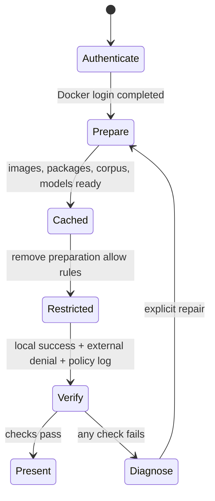

# How Docker sbx fits

## Three distinct layers

1. **Host:** Ollama executes embeddings and generation locally. It keeps native
   Apple Silicon acceleration and is explicitly configured without cloud support.
2. **sbx microVM:** OpenCode runs here. Its network requests pass through the host
   sandbox policy proxy. Only the workshop directory is shared with it.
3. **Compose inside sbx:** the microVM's own Docker daemon runs Qdrant and the
   search service. The host Docker socket is never mounted.

The custom [kit](../sandbox/spec.yaml) uses Docker's official Docker-enabled
OpenCode image, pinned by multi-platform digest. The `opencode-docker` variant is
required for the private `/var/run/docker.sock`; the plain `opencode` template
contains the CLI without that daemon socket. The kit does **not** extend the
built-in OpenCode kit: that would inherit credentials and provider network
permissions that this demo does not need. It declares only the host model endpoint
and no credentials. Shared host skills are disabled when the sandbox is created.

## Ports and networks

| Endpoint | Who reaches it | Exposure |
|---|---|---|
| Host `127.0.0.1:11435` | Sandbox through `host.docker.internal:11435` | Dedicated local Ollama |
| Sandbox `127.0.0.1:8765/mcp` | OpenCode inside the same microVM | Loopback-published MCP |
| Compose `qdrant:6333` | Ingestion and MCP containers | Internal network; no published host port |

The sandbox proxy rewrites `host.docker.internal` to `localhost` before policy
evaluation, so the kit allows **`localhost:11435`**. Do not substitute a broad
private-IP or all-hosts rule. Nested service containers preserve the proxy
environment and add their own internal service names to `NO_PROXY`.

## Policy lifecycle



Run `./workshop login` before preparation. It performs the browser device flow
only when required, verifies the resulting session, and runs Docker's diagnostic
checks. `./workshop prepare` performs the same authentication preflight.

The helper initializes `deny-all` only if policy has never been initialized. It
does not call `sbx policy reset`, which would affect unrelated sandboxes. Existing
global or organization allow rules may still apply to this sandbox. The script
must not silently remove someone else's policies to achieve a clean demo.

During preparation, named package/registry destinations are temporarily allowed
for this sandbox. Those additions are removed in `finally` even after a failed
build. Interrupted processes or host shutdown can still leave preparation state:
inspect it before presenting. A kit's allow rules and global rules are additive;
the words “Locked Down” alone do not establish effective isolation.

## Inspect and prove

```bash
sbx policy ls privacy-search-lab --wide
sbx policy check network --sandbox privacy-search-lab localhost:11435
sbx policy check network --sandbox privacy-search-lab example.com:443
sbx policy log privacy-search-lab --limit 20
./workshop privacy-check
```

The helper checks cloud-disabled host inference, selected policy decisions,
successful local access, failed external requests from both agent and service
container, and successful retrieval afterward. Read the corresponding deny log
entries: a failed network request by itself could mean DNS failure or an outage.
The finite set of probes is not proof that every untested destination is blocked.
Review the whole effective allowlist; the presentation target is only the local
model endpoint, with no external allowances.

If organization governance applies, local allow rules may be ignored. Use the
organization's approved mechanism to authorize the local endpoint. Do not work
around governance by weakening isolation or exposing Ollama to the LAN.

## Boundaries this demo does not solve

- The agent shares the sandbox trust boundary with its tools. Read-only MCP
  annotations and OpenCode permissions are useful restrictions, not protection
  against a fully compromised process with in-VM administrative privileges.
- sbx cannot control traffic generated independently by host Ollama. Its own
  cloud settings and the selected local models are checked separately.
- Mounted files remain accessible within their mount permissions. The ingestion
  container receives a read-only corpus mount; the sandbox's shared checkout is
  still writable. For hostile-agent isolation, use a dedicated mountless sandbox
  and import only required data, then separately govern its outputs.
- This is a single-user local MCP server. Authentication and per-document
  authorization would be required before multi-user or remote exposure.

References: [Docker local policy](https://docs.docker.com/ai/sandboxes/governance/access-controls/local/),
[host networking](https://docs.docker.com/ai/sandboxes/workflows/development/),
[kit behavior](https://docs.docker.com/ai/sandboxes/customize/kits/).
Hrittik Roy's [sbx walkthrough](https://hrittikhere.com/posts/sandbox-claude-code-mcp-docker-sbx)
inspired the visible blocked-request demonstration. Current CLI behavior takes
precedence over commands in older examples.
